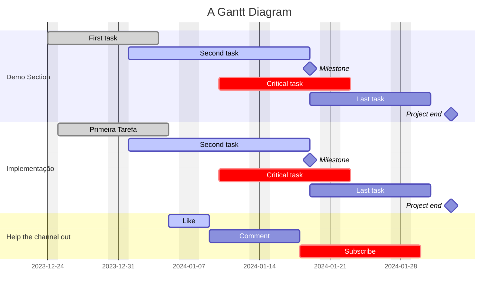

#Diagrama de Gantt
<br>



```mermaid
gantt
    dateFormat  YYYY-MM-DD
    title       Timeline Ajustada do Projeto Clube Amend 2.0 (2024)

    section Planejamento e Design      
    Início do Projeto :  2024-02-01, 2024-03-15
    Figma: 2024-02-16, 2024-04-15

    section Desenvolvimento                                     
    Desenvolvimento Flutter: 2024-02-20, 2024-06-30
    Segurança e LGPD: 2024-07-01, 2024-07-31

    section Integrações e Funcionalidades
    Desenvolvimento de Funcionalidades: 2024-06-01, 2024-08-31
    Integrações Internas (PIX, Financeiro): 2024-06-01, 2024-09-30
      
    section Testes e Ajustes
    Testes de Usabilidade: 2024-07-01, 2024-10-15
    Ajustes Baseados em Feedback: 2024-08-16, 2024-10-31

    section Lançamento
    Lançamento: 2024-10-01, 2024-11-01
    Lançamento nas Lojas de Aplicativos: 2024-11-01, 2024-12-30

    section Monitoramento Pós-Lançamento
    Monitoramento : 2024-12-01, 2024-12-31

  ```